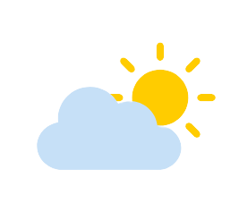
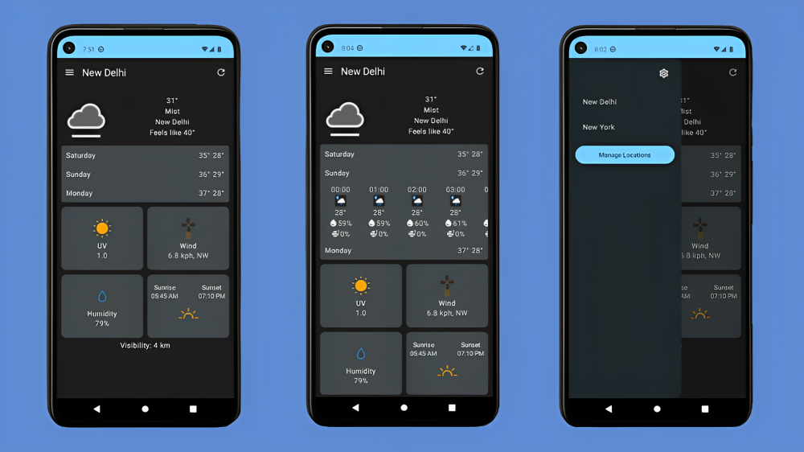

<p align="center">
  
</p>

# Weather-App
This app is built with Kotlin and Jetpack Compose. It provides weather information from [WeatherAPI](https://www.weatherapi.com/) to keep users updated about current and upcoming weather.

## 📸 Screenshots


## ✨ Features
- Plan your activities ahead using app's 3-day hourly weather forecast
- Utilizes your device's location services to automatically detect your location
- Local caching of weather

## 🏗️ Architecture
This app follows [recommended architecture guidelines](https://developer.android.com/topic/architecture) as close as possible.

## 🧪 Testing
Appropriate tests have been added to ensure app's correctness and functional behavior.

## 🖥️Installation

To clone the project, run

```
git clone git@github.com:anshtya/weather-app.git
```
Open the project in Android Studio.

This project uses WeatherAPI API key. To get yours visit [WeatherAPI](https://www.weatherapi.com/). To use the api key open `local.poperties` file and type
```
API_KEY = your_api_key
```

and rebuild the project.
